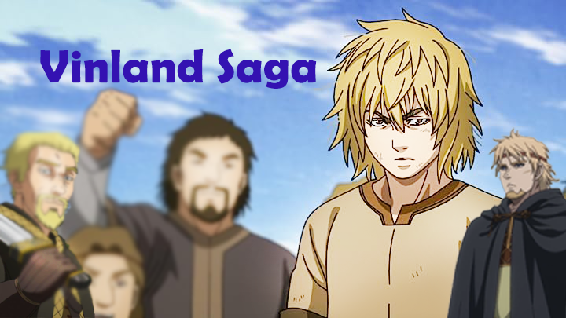

# VinlandSagaGame

**Description**:
VinlandSagaGame is an adventurous 2D game set in the captivating world of Vinland Saga. Inspired by the popular manga and anime series, the game brings the epic Viking saga to life, allowing player to embark on thrilling quests, battle fierce foes, and explore the vast landscapes of ancient Scandinavia.

**Gameplay:**
As the player, you take on the role of a brave Viking warrior seeking glory and honor in the treacherous world of Vinland Saga. Your journey begins in a small Viking village, where you learn the ways of the warrior, gather resources, and interact with other characters. As you progress, you'll join a band of fellow Vikings and set sail across the sea to discover new lands and hidden secrets.

The gameplay combines various elements, including:

1. **Combat System** : Engage in intense real-time battles against enemies using a dynamic combat system. Utilize different weapons, combos, and special abilities to defeat foes ranging from rival Viking clans to mythical creatures and monstrous beasts.
2. **Exploration and Quests** : Explore the diverse landscapes of Vinland, including dense forests, frozen tundras, and ancient ruins. Undertake quests from different NPCs, each with their own stories and challenges, and make crucial choices that influence the outcome of the game.
3. **Resource Management** : Manage resources such as food, crafting materials, and equipment to survive and thrive in the harsh Viking world. Gather resources during exploration and trade with other settlements to enhance your equipment and improve your skills.
4. **Norse Mythology** : Immerse yourself in the rich lore of Norse mythology, encountering legendary figures from Viking history and encountering mythical creatures and deities along the way.

**Graphics and Art:**
VinlandSagaGame features stunning 2D graphics with detailed character designs and beautifully rendered environments. The art style captures the essence of the Vinland Saga manga and anime, creating a visually immersive experience for players.

**Sound and Music:**
The game's soundtrack is an epic orchestral score that complements the Viking-themed setting, evoking a sense of grandeur and adventure. The sound effects are authentic, enhancing the player's immersion in battles, exploration, and interactions with the game world.

**Conclusion:**
VinlandSagaGame offers players an unforgettable journey into the world of Vikings, battles, and exploration. Whether you're a fan of the original manga and anime or simply love epic adventure games, VinlandSagaGame promises to deliver a thrilling and immersive experience that will leave players craving for more heroic tales from the Viking age. Prepare to set sail, face formidable challenges, and forge your own legendary saga in VinlandSagaGame!
